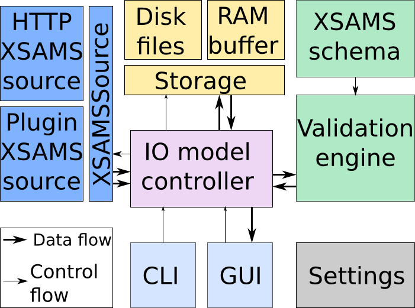

.. developerdoc

TAPValidator developer documentation
=======================================

This section describes the TAPValidator structure diagram, interaction of modules, packages.  
For further insight into modules operation see the interfaces javadoc and program sources.

Structure diagram
--------------------

	TAPValidator modules diagram

TAPValidator constists of the following functional blocks:

*	IO controller, handling the operation,
*	XSAMS XML stream sources,
*	storage, capable of returning selected blocks of data,
*	validation engine and blocks locator,
*	CLI (command line interface) controller,
*	GUI (graphical user interface) controller,
*	settings storage

Modules description 
--------------------

IOController
++++++++++++++++++++++

**IOController** (class *org.vamdc.validator.iocontroller.XSAMSDocument*) manages all the application main functions, 
links all modules together and provides easy interfaces for CLI and GUI to control them.

XSAMSSource
++++++++++++

**XSAMSSource** is able to provide the XML stream and an array of applicable Restrictable keywords.
So far, two different implementations exists, **PluginXSAMSSource** and **HTTPXSAMSSource**,
package *org.vamdc.validator.source*.

**Plugin XSAMS source** is created for the purpose of testing Java VAMDC-TAP implementation plugins without 
any infrastructure deployment. From the plugin point of view it looks identical to the 
VAMDC-TAP Java implementation, description of which is not a part of this document.

During the initialization **PliginXSAMSSource** instantiates a user-provided class, whose name is provided in settings,
asks it for the supported restrictables and then waits for queries.

While processing a query, it repeats the functionality of the framework, then asks plugin to build XSAMS document,
accepts JAXB structure for it and streams it into XML.

**HTTP XSAMS source** is able to query HTTP VAMDC-TAP services and is proven
to work with all implementations that support sync TAP endpoint. 

During the initialization it, through VOSI interfaces, checks the service availability, asks for supported restrictables,
and then waits for queries.

During the query it checks again the availability, constructs the query URL 
and opens the stream containing the node response.

This source module also provides the functionality to pretty-print incoming XML stream and supports the decompression of
a compressed stream.

Storage
++++++++++++

Storage, with main class **RAWStorage** in package *org.vamdc.validator.storage*, 
is used to keep the copy of stream produced by XSAMSSource on disk, or, 
in case of a disk inaccessibility, in a memory buffer.
It calculates document properties like size and line count, is able to copy document to arbitrary file
and provides the random access method to read specific document lines or blocks of lines.

Validation engine
++++++++++++++++++++

Validation engine, implemented in **org.vamdc.validator.validator.Validator.java**, uses Xerces2-j xml engine.
During initialization it reads the schema, prepares the validation engine.

While validating the incoming XML stream it records each validation error and XML element in which it occured, 
plus also it keeps track of positions of major XSAMS branches like species, states, process records 
and all the misc elements like Sources and Functions.

Settings
+++++++++++++++

Located in the root package, *org.vamdc.validator.Settings* keeps all the configurable bits used by modules.
HTTP VAMDC-TAP base URLs, plugin class, temp files location, schema location.

Parameter values are stored in Java Preferences subsystem.

Modification of the parameters is done either through the GUI settings dialog or through the CLI options.

Modules interaction
----------------------

During the initialization IOController reads the settings, creates the desired XSAMS source, storage
and initializes the validation engine.

During the query, IO Controller gives the query string to the source, passes the resulting stream to the validator, 
duplicating it to the storage, then when the query processing is done reports to the user interface.

During results display, IOController transparently gives out blocks of document from storage and collections of 
element and error locations from validator.

For file load operation, instead of asking the XSAMSSource module, IOController opens the file for stream input. 
The contents is processed the same way as in query procedure. 
It is also copied to the storage, so after the loading is finished there is no need for the
source file to remain available.

For file save operation IOController asks storage to dump it's contents to a specific file.

CLI operation
++++++++++++++++

Command-line interface is implemented in *org.vamdc.validator.cli.CLIProcess* class.

All required modules are instantiated once, queries are sent to the HTTPXSAMSSource, 
output is saved into destination folder, reports from all modules are combined into specific XML format and
are saved in the same folder.

GUI operation
++++++++++++++

GUI is implemented in *org.vamdc.validator.gui.MainFrame* and its controller.
Most of the main window panels are implemented in separate classes.

When initialized, GUI asks the IO controller for a list of restrictables, supported by selected source, displays it and
waits for user operations.

During the query it periodically receives events from IO controller and updates the window, displaying actual status.

When settings are saved, GUI asks the IO controller to reinitialize all modules, 
and if any error occurs refuses to close the settings dialog, giving the error information.

