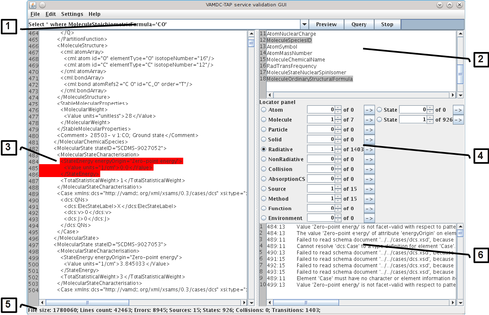

.. _gui:

Graphical user interface
===========================	
	
By default, TAPValidator starts in graphical mode.
	
When first run, it's necessary to modify the :ref:`settings`.

Then usual operation would be to do several queries on the node (network/plugin) and, if an errors occurs, modify node software code.
Iterate until documents are validating without errors.
	
	
* Main TAPValidator window
	

Main window

	Most of the time you will be using the main window.
	
	It has several important areas:
	
	# :ref:`menu`
	
	# :ref:`keywords`
	
	# :ref:`document`
	
	# :ref:`locator`
	
	# :ref:`status`
	
	# :ref:`validation`
	
.. _menu:

Menu and query
------------------
	
	This area gives the control over program.

Menu
++++++++

	Menu has the following structure
	
	* File
	
		* Open
		
		* Save
		
		* Exit
		
	* Edit
	
		* Find
		
		* Find Next
		
	* Settings
	
		* Configure
		
	* Help
	
		* About
		
	Each menu item has it's own shortcut keys combination.
	
	You may load or save files while working in any operation mode.
	
Query
+++++++

	Query panel has a selector with last 10 successful queries, Query, Stop buttons and progress indicator.
	
	Since document size is unknown during download, progress indicator just steps every 5000 lines of incoming XML document
	and gets full when document is fully loaded and processed.
	
	If any error occurs during query, error message appears, then stack trace is printed to the stdout for the detailed information.
	

.. _keywords:

Restrictables keywords
--------------------------

	This list displays a list of Restrictables keywords supported by the node.
	
	Double-click on a line will add corresponding keyword to the end of query string.
	

.. _document:

XSAMS Document
-----------------

	This panel holds XSAMS document, opened from file or returned by node.
	
	Double-click on a line centers on it.
	
	Located blocks and search results are backlit by gray color,
	elements with validation errors are backlit with red.
	

.. _locator:

Blocks locator
-----------------
	
	.. image:: img/locator_labelled.png
	
	Locator panel allows to quickly browse through document sections.
	
	# Active section indicates that this was the last read/last seeked section.
		
		Activate any inactive section to jump to current block index of that type.
	
	# Block index selector.
		
		Allows to jump to a block with selected number in order.
		
	# Jump to next block button
		
		Pressing that button would move you to the next block of that type starting from the current position in XSAMS document.
		If no blocks of this type are present latter in document, you will be directed to the first block of that type.
		
	
		
.. _status:

Status panel
--------------

	Displays some document metrics, or in case of error occured, error description. 
	

.. _validation:

Validation panel
------------------
	
	For each of the validation errors displays position in document and error description.
	
	Double-click on any line will scroll XSAMS document to selected error and highlight element that contains error.